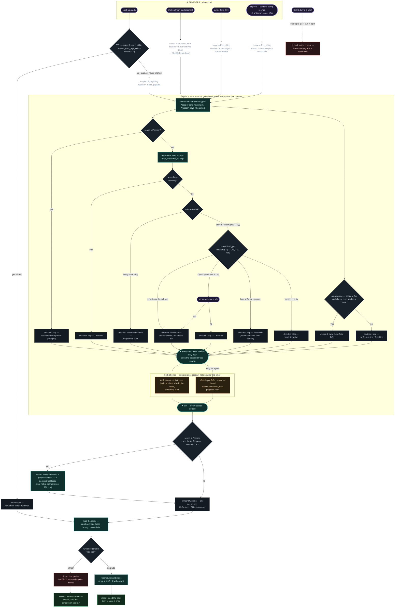

# Refresh flow: who fetches, when, and what it costs

A maintainer's map of every path that touches the network for package data —
the shell's `upgrade` and `refresh`, the CLI's `-Sy`/`-Syy`, and the implicit
triggers. Companion to [RESOLUTION_FLOW.md](RESOLUTION_FLOW.md), which picks up
where this one ends: this doc is how the data gets *current*, that one is what
happens to a cart built from it.

Three properties it encodes:

> **A fetch is never silent and never surprising.** The one expensive thing
> here — the ~2 GiB bootstrap clone — is announced and consented to at a moment
> the user can think about it, and *which* trigger asked decides whether it may
> even be offered. An incremental fetch of an existing mirror never prompts.

> **`upgrade` fetches on a TTL, not every time.** Inside
> `refresh_max_age_secs` (default 1 h) it reloads from disk without touching
> the network. The explicit `refresh` always fetches — that is the difference
> between the two commands.

> **The stamp is the AUR's.** Only a run that could have moved the mirror
> records it, so a repo-only refresh never suppresses an AUR fetch the user
> still needs.



## The decision points

Keyed to the diamonds above; each names the code that owns it.

### ① Triggers

Six reasons reach one function. `RefreshReason` is not decoration — it is the
input to the consent decision, so "who asked" literally decides whether a
bootstrap may happen. (`mirror::RefreshReason`)

| trigger | reason | scope |
|---|---|---|
| shell `upgrade` | `ShellUpgrade` | `Everything`, **but only past the TTL** |
| shell `refresh aur` | `ShellAurSync` | `Aur` |
| shell `refresh` / `refresh pacman` | `ShellRefresh` | `Everything` / `Pacman` |
| `aurox -Sy` / `-Syy` | `ExplicitSync` / `ForceReclone` | `Everything` |
| schema-bump resync | `IndexResync` | `Everything` |
| `-S <unknown target>` offer | `InstallOffer` | `Everything` |

- **TTL — fetched within `refresh_max_age_secs`?** — only `upgrade` asks; the
  explicit `refresh` is the always-fetch command. `None` (no stamp, or an
  unreadable one) reads as stale, so a never-synced session fetches; a *future*
  stamp reads as age zero rather than re-fetching forever.
  (`shell::upgrade::should_fetch`, `mirror::last_fetch_age`)

### ② The fetch — `mirror::cmd_refresh`

One function every trigger funnels into. Consent is resolved *before* the
progress display exists — dialoguer and indicatif both draw on the terminal,
and a prompt under live progress rows gets clobbered by redraws.

#### The consent gate (`consent::plan`)

Two pure decisions in sequence: what the AUR source *wants* (`decide`), then how
a wanted bootstrap obtains consent (`consent_mode`). The full table lives in
the module doc of `mirror/consent.rs`; the shape:

- **`aur = false`?** — pacman-only mode: the AUR source is skipped, prompts
  included. A standing choice, so it is never re-litigated.
- **Mirror on disk?** — a ready mirror takes the incremental path and **never
  prompts**. Absent or interrupted (a partial clone) means a bootstrap is
  needed; `-Syy` forces one over a ready mirror on purpose.
- **May this trigger bootstrap?** — the load-bearing row. `refresh aur` and a
  "yes" at the launch question are *pre-consented* (naming the AUR after the
  cost was announced **is** the answer — no second Y/n). `-Sy`/`-Syy` and the
  implicit triggers announce and ask. The bare `refresh` and `upgrade`'s TTL
  fetch **refuse quietly**: a user who answered "later" at launch must not have
  a 10-minute clone spring out of an unrelated command.
- **Every skip is typed, on every source** — the outcome is one
  `SourceOutcome<C>` per source (`Refreshed | Skipped(cause)`), generic over
  the cause because the reasons genuinely differ: `SkipCause::{Disabled,
  Declined, NotSetUp, NonInteractive, NotRequested}` for the AUR, whose
  consent answers have no repo counterpart, and `RepoSkip::{Disabled,
  NotRequested}` for the sync DBs, where `Disabled` names a different config
  knob. A source that ran narrates itself; one that didn't hands its cause to
  the caller, so each caller words its own hint
  (`upgrade` says "upgrades are repo-only; `refresh aur` syncs it"). The data
  path doesn't branch on it: an absent AUR loads as an *empty* index, not as an
  error. (`AurIndexData::load`, and CLAUDE.md's "absent provider = empty
  provider")

#### The two sources

- **Where concurrency starts** — after *every* source has been decided, not
  before. `consent::plan` returns the AUR decision with the terminal to
  itself, `RepoPlan::decide` settles the repo one beside it (pure, parameters
  injected), and only then does `context::scope` spawn the sync thread — and
  only when there is repo work to do. So the sources overlap for the duration
  of the real work and join before the stamp, while a prompt can never race a
  progress redraw: no progress display exists until the question is answered.
  (`mirror::RepoPlan::decide`)
- **Official sync DBs** run on that spawned thread, drawing into the same
  `MultiProgress` as the AUR source. Gated by `check_repo_updates` and skipped
  when the scope is `Aur`. An explicitly repo-scoped refresh with the knob off
  says so rather than doing nothing silently. (`pacman::sync::refresh_sync_db`)
- **AUR source** — bootstrap (wipe → clone → full index build → seed the
  commit-graph) or incremental (fetch → apply ref updates to the index, with a
  full rebuild as the in-place recovery when the on-disk index won't load).
  (`mirror::bootstrap_aur`, `mirror::fetch_aur`)

### The stamp

- **`scope ≠ Pacman` and the AUR source returned `Ok`** — the only condition that
  records it. A repo-only refresh never stamps (the mirror wasn't touched, and
  claiming otherwise would make the next `upgrade` skip a fetch the user still
  needs), and a failed fetch never stamps. A *skip* does stamp deliberately: a
  declined bootstrap must not re-prompt on every TTL-driven `upgrade` inside the
  window. (`mirror::record_fetch_stamp`)

### After the reload

- **`refresh` drops the cart** — the frozen plan was resolved against DBs that
  just moved, so aurox discards the whole cart rather than apply a stale
  transaction. This is the *only* point the DBs move between `add` and `apply`,
  which is exactly what keeps the frozen plan valid the rest of the time.
  (`shell::State::drop_cart_on_reload`)
- **`upgrade` replaces the cart** — recompute the candidates (repo ∪ AUR,
  honouring `--devel`), clear, seed, and resolve once, so a mid-set resolver
  error rejects the whole seed and leaves the old cart intact.
  (`AurIndexData::recompute_remaining`, `shell::State::upgrade`)
- **Ctrl-C during a fetch** aborts cleanly back to the prompt — both the gix
  and curl layers, plus libalpm's downloader via the fetch callback — but it
  abandons the *whole* command: an interrupted `upgrade` stages nothing, even
  though the repo source may already be current. (`src/interrupt.rs`,
  `pacman/dload.rs`)

## Known rough edges

- **`upgrade` is all-or-nothing across the two sources.** One TTL stamp gates a
  fetch of `Everything`, so past the TTL you wait for the AUR mirror before any
  repo upgrade is staged — bad on a slow-mirror day — and Ctrl-C abandons the
  command rather than degrading to the repo source it already has. The stamp is
  already AUR-scoped, so per-source policies are expressible; what's missing is a
  way to *say* "repo only" (`upgrade`'s argument slot is selectors, and bare
  repo names are already whole-repo selectors there). See docs/TODO.md.

---

This doc is the GitHub-rendered source of record. The diagram is also generated
(from the ```mermaid``` block above, rendered with `mmdc`, then coordinate-rounded)
as a standalone, dark-themed [`refresh-flow.svg`](refresh-flow.svg);
[`refresh-flow.html`](refresh-flow.html) frames that SVG with the hover-detail
bubbles — hover any diamond, engine step, or amber action (serve the folder, e.g.
`python3 -m http.server`, or view via GitHub Pages, so the bubbles can read the
embedded SVG).
